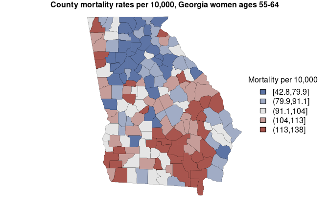
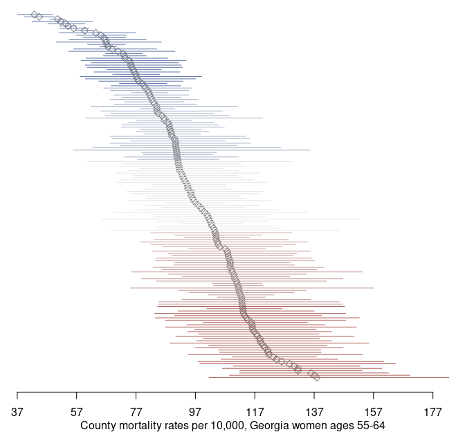

<!-- README.md is generated from README.Rmd. Please edit that file -->


## geostan: Bayesian spatial analysis

The [geostan](https://connordonegan.github.io/geostan/) R package
supports a complete spatial analysis workflow with Bayesian models for
areal data, including a suite of functions for visualizing spatial data
and model results. geostan models were built using
[Stan](https://mc-stan.org), a state-of-the-art platform for Bayesian
modeling.

Introductions to the software can be found at
[r-spatial.org](https://r-spatial.org/r/2024/08/02/geostan-introduction.html)
and in the package
[vignettes](https://connordonegan.github.io/geostan/articles/index.html).

Features include:

  - **Spatial regression and disease mapping** Statistical models for
    data recorded across areal units (states, counties, or census
    tracts) or networks, including spatial econometric models.
  - **Spatial analysis tools** Tools for visualizing and measuring
    spatial autocorrelation and map patterns, for exploratory analysis
    and model diagnostics.  
  - **Observational uncertainty** Incorporate information on data
    reliability, such as standard errors of American Community Survey
    estimates, into any geostan model.
  - **Missing and Censored observations** Vital statistics and disease
    surveillance systems like CDC Wonder censor case counts that fall
    below a threshold number; geostan can model disease or mortality
    risk for small areas with censored observations or with missing
    observations.
  - **The RStan ecosystem** Interfaces easily with many high-quality R
    packages for Bayesian modeling.
  - **Custom spatial models** Tools for building custom spatial or
    network models in Stan.

For public health research, geostan complements the
[surveil](https://connordonegan.github.io/surveil/) R package for the
study of time trends in disease incidence or mortality data.

## Installation

There are two ways to install geostan: directly from the package github
repository or from the Comprehensive R Archive Network (CRAN).

### From CRAN

Using your R console, you can install geostan from CRAN:

``` r
install.packages("geostan")
```

For most users, installing from CRAN is the recommended way to obtain
geostan.

### From github

You can also install geostan from github:

``` r
if (!require('devtools')) install.packages('devtools')
devtools::install_github("connordonegan/geostan")
```

This requires compilation of the Stan models. If you are using Windows
and installing with `install_github`, you may need to install
[Rtools](https://cran.r-project.org/bin/windows/Rtools/) first (this is
not needed when installing from CRAN). To install Rtools:

1.  Visit the Rtools site:
    <https://cran.r-project.org/bin/windows/Rtools/>
2.  Select the version that corresponds to the version of R that you
    have installed (e.g., R 4.3).
3.  After selecting the correct version, look for the “Install Rtools”
    section (just below the introductory text) and click on the
    “installer” to download it. For example, for Rtools43 (for R
    version 4.3), click on “<span style="color:blue">Rtools43
    installer</span>.”
4.  Go to the `.exe` file you just downloaded and double-click to begin
    installation of Rtools.

If you are using Mac and installing with `install_github` then you may
need to install Xcode Command Line Tools first.

## Support

All functions and methods are documented (with examples) on the website
[reference](https://connordonegan.github.io/geostan/reference/index.html)
page. See the package
[vignettes](https://connordonegan.github.io/geostan/articles/index.html)
for more on exploratory spatial analysis, spatial measurement error
models, spatial regression with raster layers, and building custom
spatial model in Stan.

To ask questions, report a bug, or discuss ideas for improvements or new
features please visit the
[issues](https://github.com/ConnorDonegan/geostan/issues) page, start a
[discussion](https://github.com/ConnorDonegan/geostan/discussions), or
submit a [pull request](https://github.com/ConnorDonegan/geostan/pulls).

## Usage

Load the package and the `georgia` county mortality data set:

``` r
library(geostan)
#> This is geostan version 0.8.1
data(georgia)
```

This has county population and mortality data by sex for ages 55-64, and
for the period 2014-2018. As is common for public access data, some of
the observations missing because the CDC has censored them to protect
privacy.

The `sp_diag` function provides visual summaries of spatial data,
including a histogram, Moran scatter plot, and map. The Moran scatter
plot displays the values against a summary of their neighboring values,
so that the slope of the regression line gives a measure of their degree
of autocorrelation.

Here is a quick visual summary of crude female mortality rates (as
deaths per 10,000):

``` r
# create adjacency matrix ("B" is for binary)
C <- shape2mat(georgia, style = "B")
#> Contiguity condition: queen
#> Number of neighbors per unit, summary:
#>    Min. 1st Qu.  Median    Mean 3rd Qu.    Max. 
#>   1.000   4.000   5.000   5.409   6.000  10.000
#> 
#> Spatial weights, summary:
#>    Min. 1st Qu.  Median    Mean 3rd Qu.    Max. 
#>       1       1       1       1       1       1

# crude mortality rate per 10,000 at risk
mortality_rate <- georgia$rate.female * 10e3

# quick spatial diagnostics
sp_diag(mortality_rate, georgia, w = C, name = "Mortality")
#> 3 NA values found in x will be dropped from data x and from matrix w (nb: this disrupts row-standardization of w)
#> Warning: Removed 3 rows containing non-finite outside the scale
#> range (`stat_bin()`).
```


Mortality rates and other health statistics for counties are, in many
cases, highly unstable estimates that cannot be relied upon for public
advisories or inference (due to small population sizes). Hence, we need
models to make inferences from small area data.

The following code fits a spatial conditional autoregressive (CAR) model
to female county mortality data. These models are used for estimating
disease risk in small areas like counties, and for analyzing covariation
of health outcomes with other area variables. The R syntax for fitting
the models is similar to using `lm` or `glm`. We provide the population
at risk (the denominator for mortality rates) as an offset term, using
the log-transform.

In our Georgia mortality data, three of the observations are missing
because they have been censored; per CDC criteria, this means that there
were 9 or fewer deaths in those counties. By using the `censor_point`
argument and setting it to `censor_point = 9`, we can easily obtain
estimates for the censored counties (along with all the others) using
models account for the censoring process:

``` r
# prepare a list of data for CAR models in Stan
cars <- prep_car_data(C)
#> Range of permissible rho values: -1.661, 1

# fit the model to female mortality rates
fit <- stan_car(deaths.female ~ offset(log(pop.at.risk.female)),
                censor_point = 9,
        data = georgia,
        car_parts = cars,
        family = poisson(),
        iter = 1e3, # no. MCMC samples
        quiet = TRUE) # to silence printing
#> 3 NA values identified in the outcome variable
#> Found in rows: 55, 126, 157
#> Warning: Tail Effective Samples Size (ESS) is too low, indicating posterior variances and tail quantiles may be unreliable.
#> Running the chains for more iterations may help. See
#> https://mc-stan.org/misc/warnings.html#tail-ess
```

Passing a fitted model to the `sp_diag` function will return a set of
diagnostics for spatial models:

``` r
sp_diag(fit, georgia)
#> 3 NA values found in x will be dropped from data x and from matrix w (nb: this disrupts row-standardization of w)
#> Warning: Removed 3 rows containing missing values or values
#> outside the scale range (`geom_pointrange()`).
```


The `print` method returns a summary of the probability distributions
for model parameters, as well as Markov chain Monte Carlo (MCMC)
diagnostics from Stan (Monte Carlo standard errors of the mean
`se_mean`, effective sample size `n_eff`, and the R-hat statistic
`Rhat`):

``` r
print(fit)
#> Spatial Model Results 
#> Formula: deaths.female ~ offset(log(pop.at.risk.female))
#> Likelihood:  poisson 
#> Link:  log 
#> Spatial method:  CAR 
#> Residual Moran Coefficient:  0.0018845 
#> Observations:  156 
#> 
#> Inference for Stan model: foundation.
#> 4 chains, each with iter=1000; warmup=500; thin=1; 
#> post-warmup draws per chain=500, total post-warmup draws=2000.
#> 
#>             mean se_mean    sd   2.5%    20%    50%    80%  97.5% n_eff  Rhat
#> intercept -4.660   0.010 0.124 -4.844 -4.728 -4.671 -4.614 -4.415   152 1.026
#> car_rho    0.926   0.002 0.057  0.788  0.884  0.938  0.974  0.997   982 1.004
#> car_scale  0.457   0.001 0.035  0.392  0.427  0.454  0.485  0.533  1869 1.001
#> 
#> Samples were drawn using NUTS(diag_e) at Mon Dec 16 09:54:18 2024.
#> For each parameter, n_eff is a crude measure of effective sample size,
#> and Rhat is the potential scale reduction factor on split chains (at 
#> convergence, Rhat=1).
```

To extract estimates of the county mortality rates from this, we apply
the `fitted` method - in this case, the fitted values from the model are
the estimates of the county mortality rates. Multiplying them by 10,000
gives mortality rate per 10,000 at risk:

``` r
# mortality rates per 10,000 at risk
mortality_est <- fitted(fit) * 10e3

# display rates with county names
county_name <- georgia$NAME
head( cbind(county_name, mortality_est) )
#>           county_name      mean        sd      2.5%       20%       50%
#> fitted[1]       Crisp 101.50235  9.768276  83.48211  93.29802 101.13725
#> fitted[2]     Candler 137.44182 16.379395 109.04185 123.43893 136.64743
#> fitted[3]      Barrow  94.08506  5.891425  82.33040  89.33693  93.98641
#> fitted[4]      DeKalb  59.79313  1.558891  56.90628  58.48399  59.77942
#> fitted[5]    Columbia  53.28957  3.303941  46.98875  50.43938  53.23976
#> fitted[6]        Cobb  54.14148  1.534015  51.08186  52.88618  54.14383
#>                 80%     97.5%
#> fitted[1] 109.73107 121.20084
#> fitted[2] 151.70773 170.97029
#> fitted[3]  99.08237 105.55138
#> fitted[4]  61.05865  62.84313
#> fitted[5]  55.97967  60.21512
#> fitted[6]  55.40963  57.25577
```

The mortality estimates are stored in the column named “mean”, and the
limits of the 95% credible interval are found in the columns “2.5%” and
“97.5%”. Here we create a map of estimates (with some help from `sf`
package):

``` r
library(sf)
#> Linking to GEOS 3.10.2, GDAL 3.4.3, PROJ 8.2.1; sf_use_s2() is TRUE

# put estimates into bins for map colors
x <- mortality_est$mean
brks <- quantile(x, probs = c(0, 0.2, 0.4, 0.6, 0.8, 1)) 
est_cut <- cut(x, breaks = brks, include.lowest = TRUE)
  
# assign colors to values
rank <- as.numeric( est_cut )  
pal_fun <- colorRampPalette( c("#5D74A5FF", "gray90", "#A8554EFF") )
pal <- pal_fun( max(rank) )
colors <-  pal[ rank ]

# set plot margins
og=par(mar=rep(1, 4))

# get boundaries
geom <- sf::st_geometry(georgia)

# map  estimates
plot(geom,
    lwd = 0.2,
    col = colors)

# legend
legend("right",
     fill = pal,
     title = 'Mortality per 10,000',
     legend = levels(est_cut),
     bty = 'n'
)

mtext('County mortality rates per 10,000, Georgia women ages 55-64', side = 3, font = 2)
```



``` r
# reset margins
par(og)
```

Using the credible intervals, we can complement our map with a
point-interval plot:

``` r
# order counties by mortality rate
index <- order(mortality_est$mean, decreasing = TRUE)
dat <- mortality_est[index, ]

# gather estimate with credible interval (95%)
est <- dat$mean
lwr <- dat$`2.5%`
upr <- dat$`97.5%`
y <- seq_along(county_name)
x_lim <- c(min(lwr), max(upr)) |>
      round()

og=par(mar = c(3, 0, 0, 0))

# points
plot(est,
     y,
     pch = 5,
     col = 'gray50',
     bty = 'L',
     axes = FALSE,
     xlim = x_lim,
     ylab = NA,
     xlab = NA)

# intervals
segments(x0 = lwr, x1 = upr,
         y0 = y, y1 = y,
     col = colors[ index ])

# x axis
axis(1, at = seq(x_lim[1], x_lim[2], by = 20))
mtext('County mortality rates per 10,000, Georgia women ages 55-64', side = 1, line = 2)
```



``` r
par(og)
```

More details and demonstrations can be found in the package [help
pages](https://connordonegan.github.io/geostan/reference/index.html) and
[vignettes](https://connordonegan.github.io/geostan/articles/index.html).

## Citing geostan

If you use geostan in published work, please include a citation.

Donegan, Connor (2022) “geostan: An R package for Bayesian spatial
analysis” *The Journal of Open Source Software*. 7, no. 79: 4716.
<https://doi.org/10.21105/joss.04716>.

[](https://doi.org/10.21105/joss.04716)

    @Article{,
      title = {{geostan}: An {R} package for {B}ayesian spatial analysis},
      author = {Connor Donegan},
      journal = {The Journal of Open Source Software},
      year = {2022},
      volume = {7},
      number = {79},
      pages = {4716},
      doi = {10.21105/joss.04716},
    }
