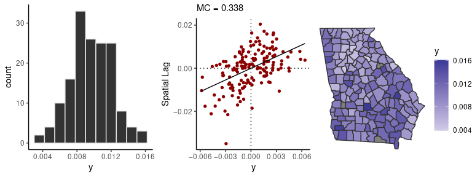
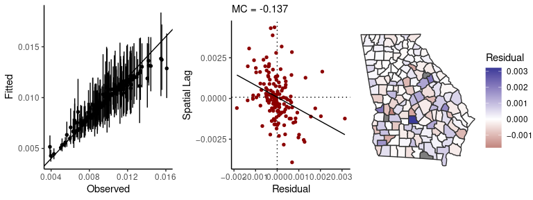

<!-- README.md is generated from README.Rmd. Please edit that file -->


## geostan: Bayesian spatial analysis

The **geostan** R package supports a complete spatial analysis workflow
with hierarchical Bayesian models (HBMs) for areal data, including a
suite of functions for visualizing spatial data and model results.

The package is designed primarily to support public health research with
spatial data; see the
[**surveil**](https://connordonegan.github.io/surveil/) R package for
time series analysis of public health surveillance data.

**geostan** is an interface to [**Stan**](https://mc-stan.org), a
state-of-the-art platform for Bayesian inference.

### Disease mapping and spatial regression

Model small-area incidence rates with mortality or disease data recorded
across areal units like states, counties, or census tracts.

### Observational uncertainty

Incorporate information on data reliability, such as standard errors of
American Community Survey estimates, into any **geostan** model.

### Censored observations

Vital statistics and disease surveillance systems like CDC Wonder censor
case counts that fall below a threshold number; **geostan** can model
disease or mortality risk with censored observations.

### Spatial analysis tools

Tools for visualizing and measuring spatial autocorrelation and map
patterns, for exploratory analysis and model diagnostics. Visual
diagnostics also support the evaluation of survey data quality and
observational error models.

### The RStan ecosystem

Compatible with a suite of high-quality R packages for Bayesian
inference and model evaluation.

### Custom spatial models

Tools for building custom spatial models in
[Stan](https://mc-stan.org/).

## Installation

Install **geostan** from R using:

``` r
if (!require(drat)) install.packages("drat")
drat::addRepo("connordonegan")
install.packages("geostan")
```

## Usage

Load the package and the `georgia` county mortality data set:

``` r
library(geostan)
data(georgia)
```

The `sp_diag` function provides visual summaries of spatial data,
including a histogram, Moran scatter plot, and map:

``` r
sp_diag(georgia$rate.female, georgia)
#> 3 NA values found in x. They will be dropped from the data before creating the Moran plot. If matrix w was row-standardized, it no longer is. To address this, you can use a binary connectivity matrix, using style = 'B' in shape2mat.
#> Warning: Removed 3 rows containing non-finite values (stat_bin).
```



There are three censored observations in the `georgia` female mortality
data, which means there were 9 or fewer deaths in those counties. The
following code fits a spatial conditional autoregressive (CAR) model to
the data. By using the `censor_point` argument we include our
information on the censored observations:

``` r
A <- shape2mat(georgia)
cars <- prep_car_data(A)
#> Range of permissible rho values:  -1.661134 1
fit <- stan_car(deaths.female ~ offset(log(pop.at.risk.female)),
                censor_point = 9,
        data = georgia,
        car_parts = cars,
        family = poisson(),
        cores = 4, # for multi-core processing
        refresh = 0) # to silence some printing
#> 
#> *Setting prior parameters for intercept
#> Distribution: normal
#>   location scale
#> 1     -4.7     5
#> 
#> *Setting prior for CAR scale parameter (car_scale)
#> Distribution: student_t
#>   df location scale
#> 1 10        0     3
#> 
#> *Setting prior for CAR spatial autocorrelation parameter (rho)
#> Distribution: uniform
#>   lower upper
#> 1  -1.7     1
```

The `sp_diag` function will also provide visual diagnostics for spatial
models:

``` r
sp_diag(fit, georgia)
#> 3 NA values found in x. They will be dropped from the data before creating the Moran plot. If matrix w was row-standardized, it no longer is. To address this, you can use a binary connectivity matrix, using style = 'B' in shape2mat.
#> Warning: Removed 3 rows containing missing values (geom_pointrange).
```


(For an altnerative measure of residual spatial autocorrelation, which
corresponds to the printed results below, see \`sp\_diag(fit, georgia,
mc\_style = “hist”).)

The `print` method returns a summary of the probability distributoins
for model parameters, including Markov chain Monte Carlo (MCMC)
diagnostics from Stan (Monte Carlo standard errors of the mean
`se_mean`, effective sample size `n_eff`, and the R-hat statistic
`Rhat`):

``` r
print(fit)
#> Spatial Model Results 
#> Formula: deaths.female ~ offset(log(pop.at.risk.female))
#> Spatial method (outcome):  CAR 
#> Likelihood function:  poisson 
#> Link function:  log 
#> Residual Moran Coefficient:  0.00222225 
#> WAIC:  1292.67 
#> Observations:  159 
#> Data models (ME): none
#> Inference for Stan model: foundation.
#> 4 chains, each with iter=2000; warmup=1000; thin=1; 
#> post-warmup draws per chain=1000, total post-warmup draws=4000.
#> 
#>             mean se_mean    sd   2.5%    25%    50%    75%  97.5% n_eff  Rhat
#> intercept -4.668   0.004 0.102 -4.850 -4.718 -4.673 -4.627 -4.466   720 1.006
#> car_rho    0.926   0.001 0.057  0.785  0.898  0.938  0.968  0.996  2986 1.000
#> car_scale  0.458   0.001 0.035  0.394  0.434  0.456  0.480  0.529  3338 1.000
#> 
#> Samples were drawn using NUTS(diag_e) at Mon Dec 27 19:56:54 2021.
#> For each parameter, n_eff is a crude measure of effective sample size,
#> and Rhat is the potential scale reduction factor on split chains (at 
#> convergence, Rhat=1).
```

For more demonstrations and discussions, see the package vignettes on
spatial autocorrelation and spatial measurement error models.
