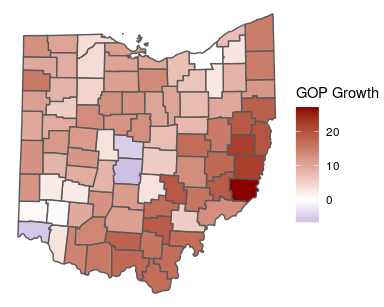
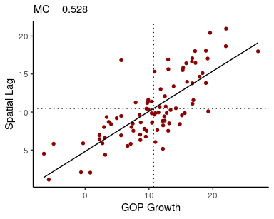
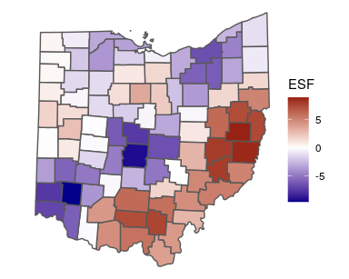
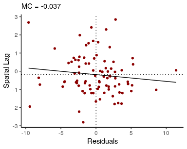
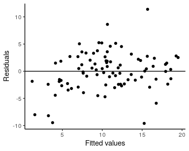
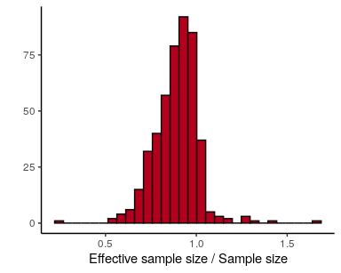
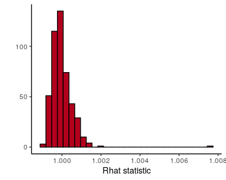
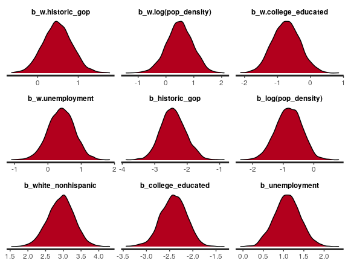
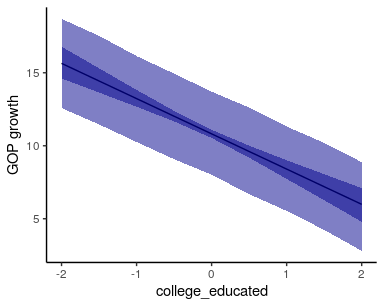

<!-- README.md is generated from README.Rmd. Please edit that file -->
geostan
=======

Bayesian Spatial Analysis with Stan
-----------------------------------

### Overview

The **geostan** package provides a user-friendly interface to Bayesian
models for areal data and is designed for accessibility and promotion of
sound spatial analysis workflows. The package is functional but still
under development and will be released to CRAN later this year.

All of the models are fit using the [Stan](https://mc-stan.org/)
probabilistic programming language and the syntax draws heavily from the
[rstanarm](https://github.com/stan-dev/rstanarm) package whenever
possible in order to maintain consistency for users. It is designed to
fit into a workflow that moves back and forth between R spatial analysis
packages ([sf](https://r-spatial.github.io/sf/),
[sp](https://github.com/edzer/sp),
[spdep](https://github.com/r-spatial/spdep),
[ggplot2](https://ggplot2.tidyverse.org/)) and Stan-based Bayesian
analysis ([rstan](https://mc-stan.org/users/interfaces/rstan),
[bayesplot](http://mc-stan.org/bayesplot/),
[loo](https://mc-stan.org/loo/)).

The following models are available:

-   Generalized linear models, with optional exchangeable (non-spatial)
    random effects.
-   Eigenvector spatial filtering (ESF) models (known as principal
    coordinates of neighbour matrices (PCNM) in ecology), following
    [Donegan et al.](https://doi.org/10.1016/j.spasta.2020.100450)
    (2020). The spatial filter coefficients are estimated using
    [Piironen and
    Vehtari’s](https://projecteuclid.org/euclid.ejs/1513306866) (2017)
    regularized horseshoe prior.
-   Intrinsic conditional autoregressive (IAR) models, using Stan code
    from [Morris et
    al.](https://doi.org/10.1016/j.sste.2019.100301) (2019) following on
    the work of
    [Besag](https://doi.org/10.1111/j.2517-6161.1974.tb00999.x) (1974)
    and [Besag and Kooperberg](https://doi.org/10.1093/biomet/82.4.733)
    (1995).
-   The scaled Besag-York-Mollie (BYM2) model introduced by [Riebler et
    al.](https://doi.org/10.1177/0962280216660421) (2016) with Stan code
    from [Morris et
    al.](https://doi.org/10.1016/j.sste.2019.100301) (2019) for disease
    mapping and similar applications, one of many variants of the
    original [BYM](https://link.springer.com/article/10.1007/BF00116466)
    model. This currently requires INLA to calculate the scale factor.

### Package installation

Since the package is not on CRAN, unmet dependencies must be installed
first. You should first install Rstan by following the [getting started
guide](https://github.com/stan-dev/rstan/wiki/RStan-Getting-Started).
Then you’ll also need the following R packages:

``` r
if (!require(sf)) install.packages("sf")
if (!require(spdep)) install.packages("spdep")
```

If you use Windows you can install geostan with the following R code:

``` r
install.packages("https://connordonegan.github.io/assets/geostan_0.0.1.zip", repos = NULL)
## though some may need:
install.packages("https://connordonegan.github.io/assets/geostan_0.0.1.zip", repos = NULL, type = "binary")
```

If you use Linux you can install the package using:

``` r
download.file("https://connordonegan.github.io/assets/dev_package.tar.gz", destfile = "geostan_0.0.1.tar.gz")
install.packages("geostan_0.0.1.tar.gz", repos = NULL)
```

or, also for Linux users only, you may install from source:

``` r
remotes::install_github("ConnorDonegan/geostan")
```

The package is not currently available for Mac users, sorry.

### Demonstration

As a quick demonstration of the package we will use a simple features
(`sf`) dataset with county-level 2016 presidential election results for
the state of Ohio. Load the dataset with `geostan` and other helpful
packages:

``` r
library(geostan)
library(sf)
library(ggplot2)
library(rstan)
library(kableExtra)
options(mc.cores = parallel::detectCores())
data(ohio)
## to learn about the data use:
##?ohio
```

We are going to model change in the Republican Presidential vote share
from the historic average (2000-2012) to 2016 (`gop_growth`).

``` r
ggplot(ohio) +
  geom_sf(aes(fill = gop_growth)) +
  scale_fill_gradient2(low = "darkblue",
                       high = "darkred",
                       name = "GOP Growth") +
  theme_void()
```



We can use a Moran plot to visualize the degree of spatial
autocorrelation in GOP growth. This plots each observation (on the
x-axis) against the mean of neighboring observations (y-axis):

``` r
W <- shape2mat(ohio, "W")
moran_plot(ohio$gop_growth, W, xlab = "GOP Growth")
```

    ## `geom_smooth()` using formula 'y ~ x'



And we can estimate an ESF model by passing the model formula, data, and
spatial connectivity matrix to `stan_esf`:

``` r
## create binary connectivity matrix
C <- shape2mat(ohio, "B")
fit <- stan_esf(gop_growth ~ 1, data = ohio, C = C)
```

Now `fit` is a list that contains summaries of estimated parameters, the
`stanfit` model returned by Stan, diagnostics, and other useful
information. We can extract the mean estimate of the spatial filter,
which is essentially a spatially varying intercept, with the `spatial`
function:

``` r
sf <- spatial(fit)$mean
```

and visualize it with `ggplot2`:

``` r
ggplot(ohio) +
  geom_sf(aes(fill = sf)) +
  scale_fill_gradient2(low = "darkblue",
                       high = "darkred",
                       name = "ESF") +
  theme_void()
```



We can also obtain summaries of the residuals and fitted values, and
confirm that there is no residual spatial autocorrelation:

``` r
res <- resid(fit)$mean
f <- fitted(fit)$mean
 ## visualize residual SA
moran_plot(res, W, xlab = "Residuals")
```

    ## `geom_smooth()` using formula 'y ~ x'



``` r
 ## fitted values vs. residuals
ggplot() +
  geom_point(aes(f, res)) +
  geom_hline(yintercept = 0) +
  labs(x = "Fitted values", y = "Residuals") +
  theme_classic()
```



Printing the model returns information about the model call (formula and
likelihood function), diagnostics including residual spatial
autocorrelation (Moran coefficient) and Widely Applicable Information
Criteria (WAIC) for model comparison, plus a summary of the posterior
distributions of top-level model parameters.

``` r
fit
```

    ## Spatial Regression Results 
    ## Formula: gop_growth ~ 1
    ## Spatial method:  RHS-ESF 
    ## Family:  gaussian 
    ## Link function:  identity 
    ## Residual Moran Coefficient:  -0.051 
    ## WAIC:  516.93 
    ## Observations:  88 
    ## RHS global shrinkage prior:  1 
    ## Inference for Stan model: esf_continuous.
    ## 4 chains, each with iter=2000; warmup=1000; thin=1; 
    ## post-warmup draws per chain=1000, total post-warmup draws=4000.
    ## 
    ##             mean se_mean    sd  2.5%    25%    50%    75%  97.5% n_eff Rhat
    ## intercept 10.701   0.006 0.423 9.858 10.421 10.694 10.982 11.538  4453    1
    ## sigma      4.063   0.008 0.384 3.403  3.795  4.026  4.294  4.922  2307    1
    ## 
    ## Samples were drawn using NUTS(diag_e) at Wed Jul  1 17:54:43 2020.
    ## For each parameter, n_eff is a crude measure of effective sample size,
    ## and Rhat is the potential scale reduction factor on split chains (at 
    ## convergence, Rhat=1).

The `Rhat` statistic should always be very near 1 with any divergence
from 1 indicating that the chains have not converged to a single
distribution. Values further than, say, 1.01 are troubling. The model
includes numerous parameters, so the most efficient way to evaluate the
diagnostics is to plot them together. To examine autocorrelation in the
chains, we can use the estimate of the effective number of posterior
samples (`n_eff`):

``` r
## check effective sample sizes
stan_ess(fit$stanfit) +
  theme_classic()
```

    ## `stat_bin()` using `bins = 30`. Pick better value with `binwidth`.



``` r
## check Rhat statistics
stan_rhat(fit$stanfit) +
  theme_classic()
```

    ## `stat_bin()` using `bins = 30`. Pick better value with `binwidth`.



We can fit the model the found in Donegan et al. (2020) with a Studen’t
t likelihood function and spatially lagged covariates:

``` r
fit3 <- stan_esf(gop_growth ~ historic_gop + log(pop_density) + white_nonhispanic + college_educated + unemployment, 
                 slx = ~ historic_gop + log(pop_density) + college_educated + unemployment,
                 scalex = TRUE, # all X variables scaled to mean = 0, std. dev = 1
                 family = student_t(),
                 data = ohio, 
                 C = C)
```

(To see why `white_nonhispanic` is missing from the `slx` formula, see
`moran_plot(ohio$white_nonhispanic, shape2mat(ohio, "W"))`—it would add
more noise than information). The spatial connectivity matrix `C` was
row-standardized internally before calculating the spatially lagged
covariates, so the constructed variables are the mean spatially lagged
values.

The `plot` and `print` methods call the bayesplot package, and they
accept a character string of parameter names such as `'beta'` for
coefficients, `'beta_ev'` for eigenvector coefficients, `'esf'` for the
spatial filter. You can also provide more specific names such as
`'b_unemployment'`.

``` r
plot(fit3, "beta", plotfun = "dens")
```



The `posterior_predict` function can be used for posterior predictive
checks together with the bayesplot package (see `?posterior_predict`)
and for hypothesis testing. The following example shows how to use it to
visualize marginal effects:

``` r
 # create data.frame all but one of the variables at their mean value (all have mean = 0, std. dev = 1)
newdata <- data.frame(historic_gop = 0, 
                 pop_density = 1, # log(1) = 0
                 college_educated = seq(-2, 2, by = 0.5), 
                 unemployment = 0, 
                 white_nonhispanic = 0
                 )

pred.df = posterior_predict(fit3, # fitted model
                            newdata,  # data for predictions
                            spatial = FALSE, # set the spatial component to zero
                            summary = TRUE, # return a data.frame with 95% credible intervals
)

 # plot the mean of the predictive distribution
fig <- ggplot(pred.df, aes(x=college_educated)) +
    geom_line(aes(y = mu))
  
 # add credible interval around the mean
fig <- fig +
  geom_ribbon(aes(ymin = mu.lwr, 
                  ymax = mu.upr),
              alpha = .5,
              fill = 'darkblue') 
      
 # add cred. interval for the predictive distribution
fig <- fig +
  geom_ribbon(aes(ymin = pred.lwr,
                  ymax = pred.upr),
              alpha = 0.5,
              fill = 'darkblue')
 
fig +
  labs(y = "GOP growth") +
  theme_classic()
```



### References

Besag, J. (1974). Spatial interaction and the statistical analysis of
lattice systems. *Journal of the Royal Statistical Society: Series B
(Methodological)*, 36(2), 192-225.

Besag, J., & Kooperberg, C. (1995). On conditional and intrinsic
autoregressions. *Biometrika*, 82(4), 733-746.

Besag, J., York, J., & Mollié, A. (1991). Bayesian image restoration,
with two applications in spatial statistics. *Annals of the institute of
statistical mathematics*, 43(1), 1-20.

Donegan, C., Chun, Y., & Hughes, A. E. (2020). Bayesian estimation of
spatial filters with Moran’s eigenvectors and hierarchical shrinkage
priors. *Spatial Statistics*, 100450.

Morris, M., Wheeler-Martin, K., Simpson, D., Mooney, S. J., Gelman, A.,
& DiMaggio, C. (2019). Bayesian hierarchical spatial models:
Implementing the Besag York Mollié model in stan. *Spatial and
spatio-temporal epidemiology*, 31, 100301.

Piironen, J., & Vehtari, A. (2017). Sparsity information and
regularization in the horseshoe and other shrinkage priors. *Electronic
Journal of Statistics*, 11(2), 5018-5051.

Riebler, A., Sørbye, S. H., Simpson, D., & Rue, H. (2016). An intuitive
Bayesian spatial model for disease mapping that accounts for scaling.
*Statistical methods in medical research*, 25(4), 1145-1165.

Watanabe, S. (2013). A widely applicable Bayesian information criterion.
*Journal of Machine Learning Research*, 14(Mar), 867-897.
