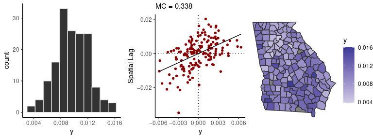
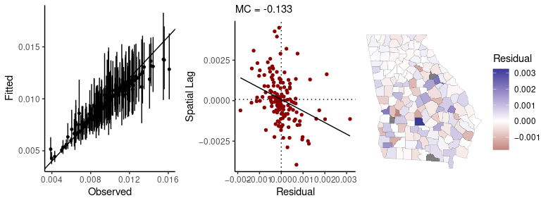

<!-- README.md is generated from README.Rmd. Please edit that file -->


## geostan: Bayesian spatial analysis

The [**geostan**](https://connordonegan.github.io/geostan/) R package
supports a complete spatial analysis workflow with Bayesian models for
areal data, including a suite of functions for visualizing spatial data
and model results. **geostan** models were built using
[**Stan**](https://mc-stan.org), a state-of-the-art platform for
Bayesian modeling. The package is designed partly for public health
research with spatial data, for which it complements the
[**surveil**](https://connordonegan.github.io/surveil/) R package for
time series analysis of public health surveillance data.

Features include:

  - **Disease mapping and spatial regression** Statistical models for
    data recorded across areal units like states, counties, or census
    tracts.
  - **Spatial analysis tools** Tools for visualizing and measuring
    spatial autocorrelation and map patterns, for exploratory analysis
    and model diagnostics.  
  - **Observational uncertainty** Incorporate information on data
    reliability, such as standard errors of American Community Survey
    estimates, into any **geostan** model.
  - **Missing and Censored observations** Vital statistics and disease
    surveillance systems like CDC Wonder censor case counts that fall
    below a threshold number; **geostan** can model disease or mortality
    risk for small areas with censored observations or with missing
    observations.
  - **The RStan ecosystem** Interfaces easily with many high-quality R
    packages for Bayesian modeling.
  - **Custom spatial models** Tools for building custom spatial models
    in [Stan](https://mc-stan.org/).

## Installation

Install **geostan** from CRAN using:

``` r
install.packages("geostan")
```

## Support

All functions and methods are documented (with examples) on the website
[reference](https://connordonegan.github.io/geostan/reference/index.html)
page. See the package
[vignettes](https://connordonegan.github.io/geostan/articles/index.html)
for more on exploratory spatial analysis, spatial measurement error
models, spatial regression with raster layers, and building custom
spatial model in Stan.

To ask questions, report a bug, or discuss ideas for improvements or new
features please visit the
[issues](https://github.com/ConnorDonegan/geostan/issues) page, start a
[discussion](https://github.com/ConnorDonegan/geostan/discussions), or
submit a [pull request](https://github.com/ConnorDonegan/geostan/pulls).

## Usage

Load the package and the `georgia` county mortality data set:

``` r
library(geostan)
data(georgia)
```

This has county population and mortality data by sex for ages 55-64, and
for the period 2014-2018. As is common for public access data, some of
the observations missing because the CDC has censored them.

The `sp_diag` function provides visual summaries of spatial data,
including a histogram, Moran scatter plot, and map. Here is a visual
summary of crude female mortality rates (as deaths per 10,000):

``` r
A <- shape2mat(georgia, style = "B")
mortality_rate <- georgia$rate.female * 10e3
sp_diag(mortality_rate, georgia, w = A)
#> 3 NA values found in x will be dropped from data x and matrix w
#> Warning: Removed 3 rows containing non-finite values (`stat_bin()`).
```



Three of the observations are censored, which means (per CDC criteria)
there were 9 or fewer deaths in those counties. The following code fits
a spatial conditional autoregressive (CAR) model to female county
mortality data. These models are used for estimating disease risk in
small areas like counties, and for analyzing covariation of health
outcomes with other area qualities. The R sytax for fitting the models
is similar to using `lm` or `glm`. We provide the population at risk
(the denominator for mortality rates) as an offset term, using the
log-transform. By using the `censor_point` argument and setting it to
`9`, the model will produce estimates for every county and account for
the censoring process in doing so:

``` r
cars <- prep_car_data(A)
#> Range of permissible rho values:  -1.661134 1
fit <- stan_car(deaths.female ~ offset(log(pop.at.risk.female)),
                censor_point = 9,
        data = georgia,
        car_parts = cars,
        family = poisson(),
        cores = 4, # for multi-core processing
        refresh = 0) # to silence some printing
#> 
#> *Setting prior parameters for intercept
#> Distribution: normal
#>   location scale
#> 1     -4.7     5
#> 
#> *Setting prior for CAR scale parameter (car_scale)
#> Distribution: student_t
#>   df location scale
#> 1 10        0     3
#> 
#> *Setting prior for CAR spatial autocorrelation parameter (car_rho)
#> Distribution: uniform
#>   lower upper
#> 1  -1.7     1
#> Warning: There were 1 divergent transitions after warmup. See
#> https://mc-stan.org/misc/warnings.html#divergent-transitions-after-warmup
#> to find out why this is a problem and how to eliminate them.
#> Warning: Examine the pairs() plot to diagnose sampling problems
```

Passing a fitted model to the `sp_diag` function will return a set of
diagnostics for spatial models:

``` r
sp_diag(fit, georgia, w = A)
#> Using sp_diag(y, shape, rates = TRUE, ...). To examine data as (unstandardized) counts, use rates = FALSE.
#> 3 NA values found in x will be dropped from data x and matrix w
#> Warning: Removed 3 rows containing missing values (`geom_pointrange()`).
```



The `print` method returns a summary of the probability distributions
for model parameters, as well as Markov chain Monte Carlo (MCMC)
diagnostics from Stan (Monte Carlo standard errors of the mean
`se_mean`, effective sample size `n_eff`, and the R-hat statistic
`Rhat`):

``` r
print(fit)
#> Spatial Model Results 
#> Formula: deaths.female ~ offset(log(pop.at.risk.female))
#> Spatial method (outcome):  CAR 
#> Likelihood function:  poisson 
#> Link function:  log 
#> Residual Moran Coefficient:  0.0010915 
#> WAIC:  1291.77 
#> Observations:  159 
#> Data models (ME): none
#> Inference for Stan model: foundation.
#> 4 chains, each with iter=2000; warmup=1000; thin=1; 
#> post-warmup draws per chain=1000, total post-warmup draws=4000.
#> 
#>             mean se_mean    sd   2.5%    25%    50%    75%  97.5% n_eff  Rhat
#> intercept -4.675   0.006 0.124 -4.855 -4.716 -4.675 -4.632 -4.493   470 1.005
#> car_rho    0.924   0.001 0.058  0.779  0.894  0.937  0.967  0.995  2401 1.003
#> car_scale  0.458   0.001 0.036  0.394  0.433  0.456  0.481  0.536  4330 1.001
#> 
#> Samples were drawn using NUTS(diag_e) at Thu Apr  4 13:27:47 2024.
#> For each parameter, n_eff is a crude measure of effective sample size,
#> and Rhat is the potential scale reduction factor on split chains (at 
#> convergence, Rhat=1).
```

Applying the `fitted` method to the fitted model will return the fitted
values from the model - in this case, the fitted values are the
estimates of the county mortality rates. Multiplying them by 10,000
gives mortality rate per 10,000 at risk:

``` r
mortality_est <- fitted(fit) * 10e3
county_name <- georgia$NAME
head( cbind(county_name, mortality_est) )
#>           county_name      mean        sd      2.5%       20%       50%
#> fitted[1]       Crisp 101.61790  9.506317  83.78949  93.66381 101.26958
#> fitted[2]     Candler 137.41768 15.722248 109.22946 123.90982 136.84672
#> fitted[3]      Barrow  94.18066  6.250739  82.31643  88.97269  93.89492
#> fitted[4]      DeKalb  59.74114  1.569311  56.66737  58.43251  59.73669
#> fitted[5]    Columbia  53.38565  3.398035  46.92323  50.59619  53.32337
#> fitted[6]        Cobb  54.11984  1.444684  51.32024  52.91944  54.10460
#>                 80%     97.5%
#> fitted[1] 109.56233 120.87915
#> fitted[2] 150.20673 169.74538
#> fitted[3]  99.32714 107.29305
#> fitted[4]  61.06537  62.76951
#> fitted[5]  56.14366  60.34461
#> fitted[6]  55.32105  57.03416
```

The mortality estimates are stored in the column named “mean”, and the
limits of the 95% credible interval are found in the columns “2.5%” and
“97.5%”.

Details and demonstrations can be found in the package [help
pages](https://connordonegan.github.io/geostan/reference/index.html) and
[vignettes](https://connordonegan.github.io/geostan/articles/index.html).

## Citing geostan

If you use geostan in published work, please include a citation.

Donegan, Connor (2022) “geostan: An R package for Bayesian spatial
analysis” *The Journal of Open Source Software*. 7, no. 79: 4716.
<https://doi.org/10.21105/joss.04716>.

[](https://doi.org/10.21105/joss.04716)

    @Article{,
      title = {{geostan}: An {R} package for {B}ayesian spatial analysis},
      author = {Connor Donegan},
      journal = {The Journal of Open Source Software},
      year = {2022},
      volume = {7},
      number = {79},
      pages = {4716},
      doi = {10.21105/joss.04716},
    }
