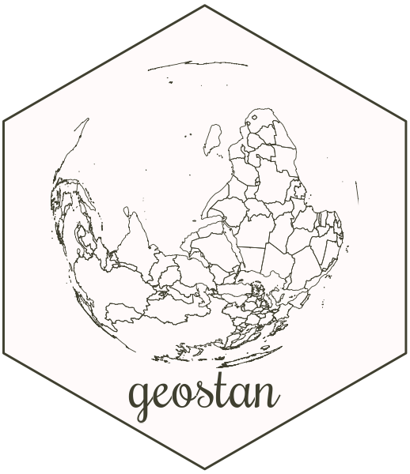

# geostan 

The **geostan** R package supports a complete spatial analysis
workflow with hierarchical Bayesian models (HBMs) for areal
data and a variety of functions for visualizing spatial data and model results.

**geostan** is an interface to [Stan](https://mc-stan.org).

### Disease mapping and spatial regression

Model small-area incidence rates with mortality or disease data recorded across areal units like counties or census tracts.

### Observational uncertainty 

Incorporate information on data reliability into any **geostan** model. Built specifically for American Community Survey (ACS) data.

### Spatial analysis tools

Tools for visualizing and measuring spatial autocorrelation and map patterns, for exploratory analysis and model criticism.

### Custom Stan models

Tools for building custom spatial models in [Stan](https://mc-stan.org/).

### RStan ecosystem

Compatible with a suite of high-quality R packages for Bayesian inference.

## Installation

Install **geostan** using:

``` r
if (!require(drat)) install.packages("drat")
drat::addRepo("connordonegan")
install.packages("geostan")
```
