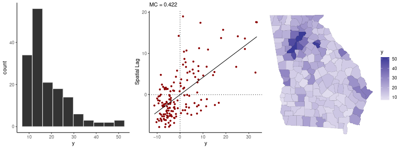

# Summary

Analyses of data collected across areal units, such as census tracts and states, are now ubiquitous in the social and health sciences. Data sources include surveys (especially large government-back surveys like the US Census Bureau's American Community Survey (ACS)), vital statistics systems, and disease registries (particularly cancer registries). These data sources can provide crucial information about population health and socio-economic outcomes, but many standard (non-spatial) statistical methods and workflows are either not applicable to spatial data or they require adjustment [@cressie_2015; @haining_2020].

This paper introduces **geostan**, an R [@rstats] package for analyzing spatial data using Bayesian inference. **geostan**'s spatial models were built using Stan, a platform for Markov chain Monte Carlo (MCMC) sampling [@gabry_2020; @stan_2022; @stan_2022b]. The primary focus of the package is areal data for socio-economic and health research. The package provides tools for a complete workflow for spatial regression and disease mapping, and has unique spatial measurement error (ME) models suitable for researchers using ACS estimates as covariates [@donegan_2021]. 

# Statement of need

The distinguishing characteristic of spatial data is that maps of the data typically contain moderate to strong spatial patterns, or spatial autocorrelation, which typically reduces effective sample size (ESS) and renders many standard statistical methods inappropriate [@student_1914; @clifford_1989]. In addition, spatial patterns are often of direct interest---for example, disease mapping studies are concerned primarily with understanding how disease or mortality risk vary over space.

A major challenge for spatial analysis is data quality, particularly for researchers using survey-based covariates. A single spatial analysis may use dozens, or even thousands, of error-laden survey estimates. Sampling error in ACS estimates is often substantial in magnitude and socially patterned [@folch_2016; @donegan_2021], which can have real consequences on communities and service providers [@bazuin_2013]. Spatial ME models are required to avoid ME biases and unwarranted levels of confidence in results.

Existing R packages with spatial modeling functions include **spatialreg** [@bivand_2015], **INLA** [@rue_2009], **ngspatial** [@hughes_2020], **BayesX** [@belitz_2022; @umlauf_2015], **CARBayes** [@lee_2013], and **nimble** [@valpine_2017]. Custom spatial models can be built using **rstan** [@stan_2022], **INLA**, and **nimble**, including spatial ME models, but this requires specialized programming and statistical skills. **geostan** fills two gaps in this software landscape. First, **geostan** offers spatial ME models that are appropriate for survey-based covariates. Second, **geostan** provides spatial model diagnostic functions that make it easy for users to evaluate model results even if they are unfamiliar with MCMC analysis.

# Functionality

**geostan** provides tools for spatial data visualization, construction of spatial weights matrices, spatial ME models, models for censored count data, and multiple types of spatial statistical models for continuous and discrete data types. The `shape2mat` function creates spatial weights matrices by first calling the **spdep** package [@bivand_2013] to identify the adjacency structure of the spatial data, and results are returned to the user in sparse matrix format using the **Matrix** package [@bates_2022].

**geostan** uses MCMC for inference, which allows users to conduct formal inference on generated quantities of interest. The models are built using the Stan modeling language, a state-of-the-art platform for MCMC sampling [@gabry_2020; @stan_2022; @stan_2022b], but users only need to be familiar with the standard R formula interface. Because **geostan** returns `stanfit` objects from **rstan**, it is compatible with the **rstan** ecosystem of packages including **shinystan** for visual summaries of model parameters and MCMC diagnostics [@gabry_2018], **tidybayes** for working with MCMC samples [@kay_2022], and **bridgesampling** for model comparison using Bayes factors [@gronau_2020].

## Exploratory spatial data analysis (ESDA)

The package provides convenience functions for visualizing spatial patterns and conducting ESDA, including

  - Moran scatter plot for visualizing spatial autocorrelation [@chun_2013]
  - Moran coefficient and Geary Ratio for measuring global spatial autocorrelation [@chun_2013]
  - Local Moran's I and local Geary's C for measuring and visualizing local spatial autocorrelation [@anselin_1995]
  - The Approximate Profile Likelihood (APLE) estimator for measuring spatial autocorrelation [@li_2007]
  - Effective sample size (ESS) calculation [@griffith_2005]

These tools are provided for exploratory analysis, but not for detection of clusters. For this and other reasons, p-values are not provided. Graphics are created with **ggplot2** [@wickham_2016].

**geostan** also provides a convenience function for obtaining a quick visual summary of a variable (see \autoref{fig:sp_diag}). When a fitted model is provided, the `sp_diag` function returns graphical diagnostics for model residuals. 
  
{ width=75% }

## Spatial models

Table 1 lists the types of spatial models that are implemented in **geostan**. In addition to (non-spatial) generalized linear models (GLMs), options include spatial conditional autoregressive (CAR) models [@donegan_2022], intrinsic conditional autoregressive (ICAR) models including the BYM [@besag_1991], and BYM2 specifications [@riebler_2016; @morris_2019; @donegan_2021b], simultaneously-specified spatial autoregressive (SAR) models [@cliff_1981] (which are referred to as the spatial error model (SEM) in the econometrics literature [@lesage_2014]), and eigenvector spatial filtering (ESF) [@griffith_2019; @donegan_2020]. 

\begin{table}[h]
  \centering
    \caption{Spatial models currently implemented in \textbf{geostan}.}
  \begin{tabular}{lcccc}
  \hline
   &  Gaussian & Student's $t$ & Poisson & Binomial \\
 \hline
 CAR & x &  & x & x  \\
 ESF & x & x & x & x \\
GLM & x & x & x & x \\ 
 ICAR & & & x & x \\
 SAR & x & & x & x \\
 \hline
  \end{tabular}
  \label{tbl:models}
  \end{table}

All of the models allow for a set of exchangeable 'random effects' to be added, and spatially lagged covariates (SLX) can also be added to any of the models. While proper CAR models have been avoided in the past due to their computational burden, the CAR model is the most efficient spatial model in **geostan**. It is fast enough to work interactively on a laptop with more than $3000$ observations, such as U.S. county data [@donegan_2022]. 
  
A set of functions for working with model results conveniently extracts fitted values, marginal effects, residuals, spatial trends, and posterior (or prior) predictive distributions. Users are encouraged to always undertake a thoughtful spatial analysis of model residuals and other quantities to critique and improve their models through successive rounds of ESDA [cf. @gabry_2019].

## Spatial ME models

ME models can be added to any **geostan** model. These are models for covariates measured with error, particularly small-area survey estimates with standard errors. The ME models treat the true covariate values as unknown parameters or latent variables, which are assigned a spatial CAR prior model. Users provide the scale of observational uncertainty or ME (e.g., survey standard errors) as data [@donegan_2021; cf. @bernardinelli_1997; @xia_1998; @kang_2009; @logan_2019]. All uncertain inferences from the ME models are automatically propagated throughout the regression or a disease mapping model, and graphical diagnostics are provided for evaluating results of spatial ME models.

# Acknowledgements

I am grateful for support this project received from Esri Inc. and from the Geography and Geospatial Information Sciences program at The University of Texas at Dallas.

# References
